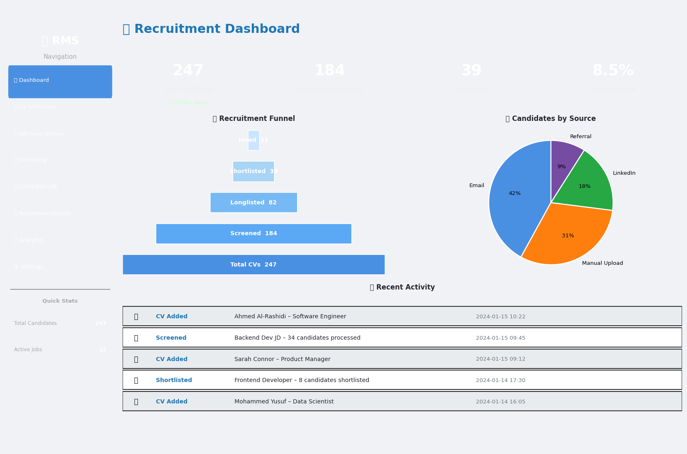
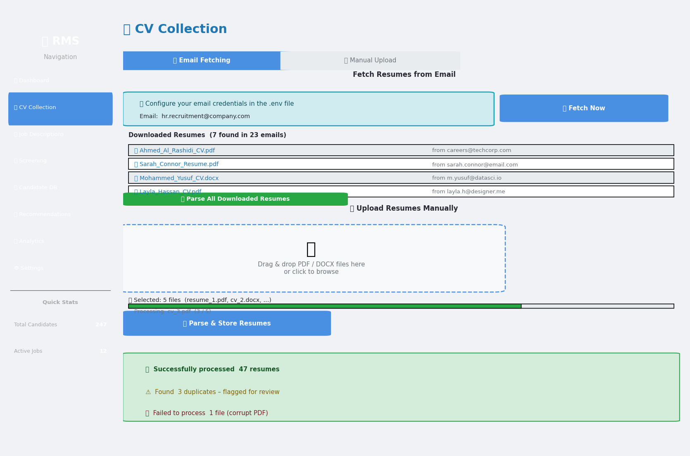
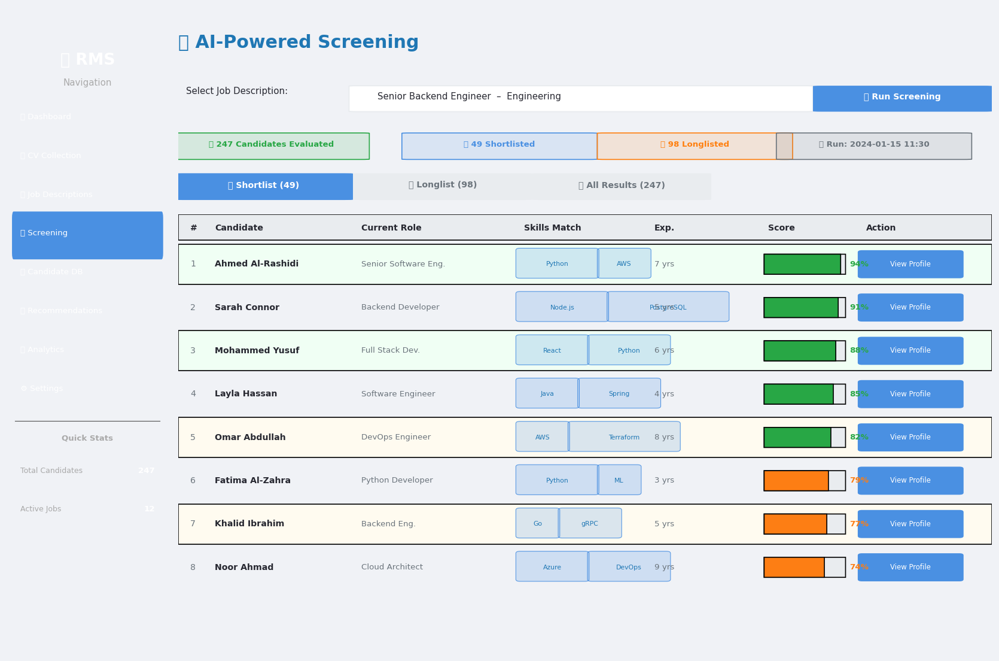
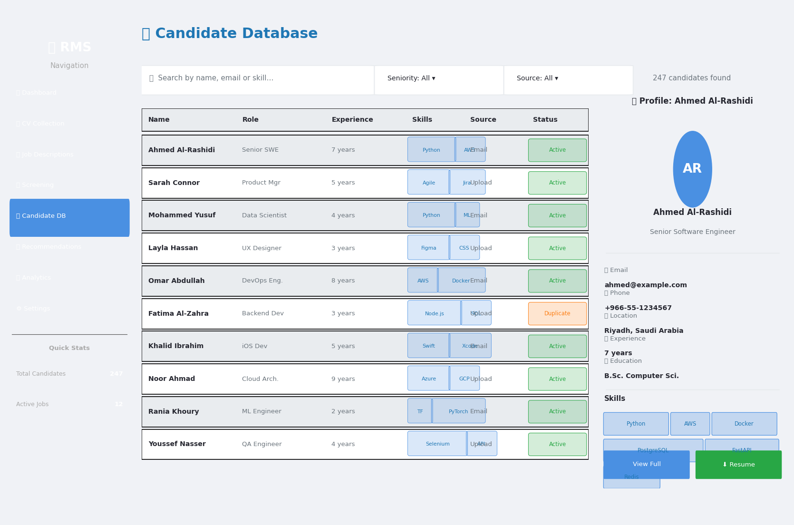
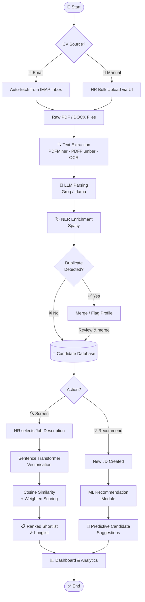
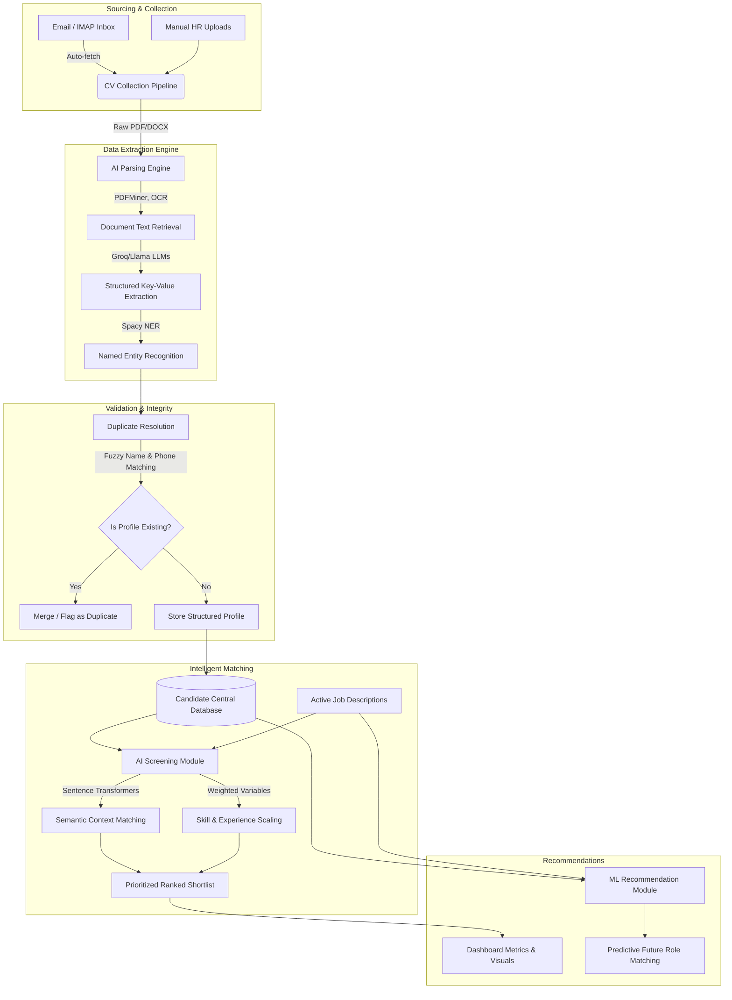

# 🎯 Recruitment Management System (RMS)

## Complete AI-Powered Recruitment Platform

A comprehensive, production-ready recruitment management system designed to streamline the hiring process from candidate entry to final selection. The platform bridges the gap between traditional applicant tracking and modern AI capabilities, automating CV collection, data extraction, duplicate resolution, and predictive candidate matching for future opportunities.

---

## Application Screenshots

> **Note:** Replace the placeholder images below with actual screenshots once the application is running. Screenshots should be placed in `assets/screenshots/`.

### 📊 Dashboard – KPI Overview & Recruitment Funnel

---

### 📧 CV Collection – Email Fetching & Manual Upload

---

### 🔍 Screening Results – AI-Ranked Shortlist

---

### 👥 Candidate Database – Search & Profile View

---

### 💡 Vacancy Recommendations – Predictive Matching

---

### 📈 Analytics & Reports – Trend Visualization

---

## How It Works

The system follows a linear, AI-augmented pipeline from sourcing raw CVs through to delivering a ranked shortlist and predictive recommendations.

### Step 1 – CV Sourcing
HR professionals can source candidate CVs in two ways:
- **Automated Email Listener:** The system connects to a configured IMAP inbox, scans for recruitment-related emails, and downloads attached PDF/DOCX files automatically.
- **Manual Batch Upload:** HR staff can drag and drop multiple CV files directly through the Streamlit frontend without configuring email.

### Step 2 – AI Document Parsing
Each CV is fed through the multi-tiered **Text Extraction Engine**:
1. **Structural Parsing:** PDFMiner and PDFPlumber extract raw text from both standard and non-standard PDF layouts. OCR handles scanned or image-based documents.
2. **LLM Extraction:** The extracted text is passed to a Groq-hosted Llama model, which identifies and structures key entities – name, contact details, work history, skills, certifications, education, and seniority level – returning a clean JSON payload.
3. **NER Enrichment:** Spacy Named Entity Recognition cross-validates and maps entities to the standardized database schema, catching anything the LLM may have normalized differently.

### Step 3 – Duplicate Detection & Profile Storage
Before a new candidate profile is committed to the database, the **Duplicate Resolution Engine** runs three validation checks:
- Exact email match
- Normalized phone number comparison
- Token Set Ratio fuzzy-matching on candidate names

Profiles that exceed a configurable similarity threshold are flagged, merged, or suspended to prevent duplicate entries from distorting shortlist rankings.

### Step 4 – Semantic AI Screening
When an HR user triggers screening for a Job Description:
1. The active JD's requirements are vectorized using **Sentence Transformers**.
2. Every stored candidate profile is also vectorized and scored for cosine similarity against the JD vector.
3. Explicit keyword, certification, and experience-year signals are then layered on top with **HR-configurable weightings**.
4. Candidates are sorted into a **Prioritized Ranked Shortlist** (top matches), a Longlist (secondary candidates), and a full results table.

### Step 5 – Predictive Recommendations
The **ML Recommendation Module** operates independently of active screening:
- When a new JD is created, the module runs a background pass against the *entire* historical candidate pool, including previously reviewed or rejected applicants.
- It surfaces candidates who are mathematically well-aligned to the new role but may have been missed in prior cycles – preventing talent from falling through the cracks.

### Step 6 – Dashboard & Analytics
All pipeline activity is reflected in real time on the **Dashboard** and **Analytics** pages:
- Aggregate ingestion counts and parsing success rates
- Recruitment funnel visualization (sourced → parsed → screened → shortlisted)
- Per-position metric breakdowns
- Exportable CSV reports for offline analysis and stakeholder reporting

---

## 🔄 Application Flowchart

---

## 🏗 System Workflow

---

## ✨ Core Operational Dynamics

This ecosystem handles high volumes of applicant data efficiently by applying structured validation and machine intelligence at every stage.

### 1. Robust Sourcing Automation
The system continuously ingests applicant data without manual copying. It integrates an automated Email Listener that fetches relevant attachments directly from connected recruitment inboxes. Alternatively, HR professionals can use batch uploads via the frontend interface.

### 2. Multi-Tiered AI Parsing
Candidate data extraction avoids rigid, rule-based matching. Instead, the Text Extraction Engine applies OCR and structural parsing (PDFMiner, PDFPlumber) across non-standard formats. Next, a tuned LLM engine processes the unstructured context to identify deeply layered entities like Project History, Seniority level, and specific Tech Stacks. Finally, Named Entity Recognition maps this data into a standardized database schema.

### 3. Objective Semantic Screening
Candidates are scored objectively against active Job Descriptions:
- **Semantic Vector Analysis:** Using Sentence Transformers, the candidate's holistic profile is vectorized and tested for similarity against the JD's requirements.
- **Configurable Scaling:** Explicit keywords, certifications, and experience timelines are evaluated alongside semantic context with HR-defined weightings, ensuring screening results rank accuracy over generic keyword-stuffing.

### 4. Continuous Pool Revitalization
To ensure no talent is wasted, the ML Recommendation Module actively works in the background. When a new Job Description is synthesized, the system runs predictive matching against the entire historical candidate database, successfully identifying previously rejected applicants mathematically aligned to new roles.

### 5. Definitive Duplicate Resolution
Prior to storing candidate profiles, an intelligent Duplicate Engine employs multiple layers of verification:
- Direct email checks
- Phone normalization schemas
- Token Set Ratios on fuzzily matched names
Profiles with high overlap are suspended and merged, preventing statistical skew in longlists.

### 6. Analytics and Funnel Insight
Key recruitment pipelines are visualized through the Dashboard, producing actionable indicators. Decision-makers can observe aggregate ingestion, real-time funnel visualization, metric breakdowns per position, and precise shortlisting rations cleanly.

---

## 🛠 System Architecture Profile

- **Backend Architecture:** Powered by **Python** driving robust, concurrent multi-module interactions across extraction and ML inferencing stages.
- **User Interface:** Fluid interfaces managed via **Streamlit**, ensuring a clean administrative capability suite.
- **Persistence:** High-availability **PostgreSQL** schema configured with designated indexing across candidates, logging, configurations, and analytical views.
- **Intelligence Stack:** Built utilizing deep learning libraries (**Spacy**, **Sentence Transformers**) and connected cloud LLM APIs (**Groq**) to provide top-tier inference speeds coupled with local logic.

---

*This document outlines the conceptual routing and capabilities inherent to the Recruitment Management System.*
