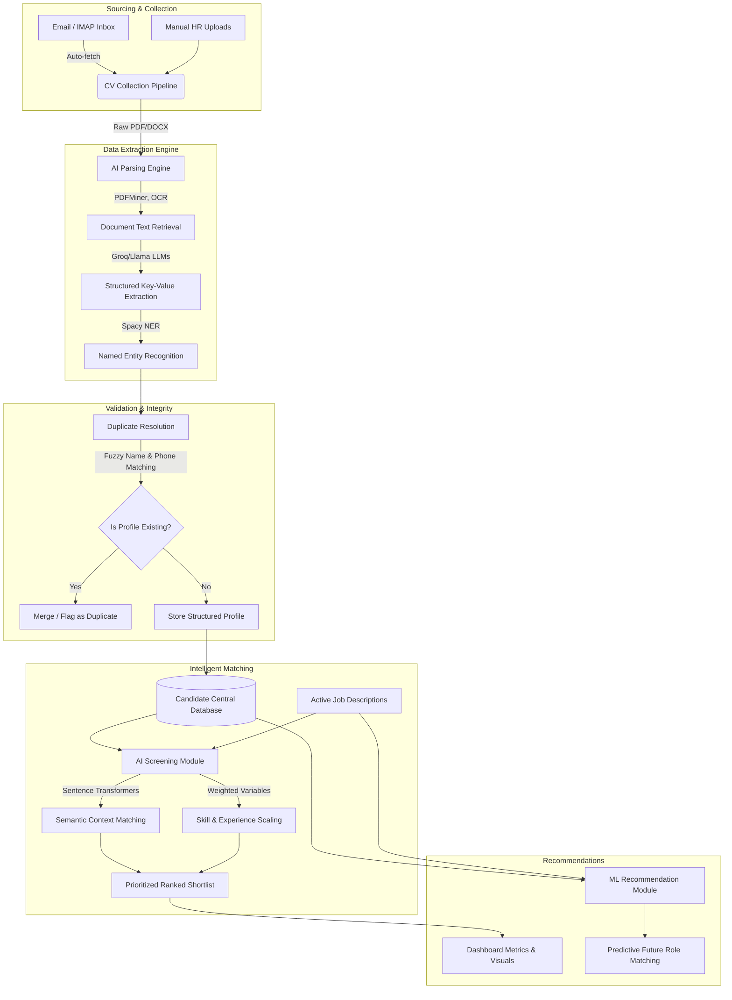

# 🎯 Recruitment Management System (RMS)

## Complete AI-Powered Recruitment Platform

A comprehensive, production-ready recruitment management system designed to streamline the hiring process from candidate entry to final selection. The platform bridges the gap between traditional applicant tracking and modern AI capabilities, automating CV collection, data extraction, duplicate resolution, and predictive candidate matching for future opportunities.

---

## 🏗 System Workflow

---

## ✨ Core Operational Dynamics

This ecosystem handles high volumes of applicant data efficiently by applying structured validation and machine intelligence at every stage.

### 1. Robust Sourcing Automation
The system continuously ingests applicant data without manual copying. It integrates an automated Email Listener that fetches relevant attachments directly from connected recruitment inboxes. Alternatively, HR professionals can use batch uploads via the frontend interface.

### 2. Multi-Tiered AI Parsing
Candidate data extraction avoids rigid, rule-based matching. Instead, the Text Extraction Engine applies OCR and structural parsing (PDFMiner, PDFPlumber) across non-standard formats. Next, a tuned LLM engine processes the unstructured context to identify deeply layered entities like Project History, Seniority level, and specific Tech Stacks. Finally, Named Entity Recognition maps this data into a standardized database schema.

### 3. Objective Semantic Screening
Candidates are scored objectively against active Job Descriptions:
- **Semantic Vector Analysis:** Using Sentence Transformers, the candidate's holistic profile is vectorized and tested for similarity against the JD's requirements.
- **Configurable Scaling:** Explicit keywords, certifications, and experience timelines are evaluated alongside semantic context with HR-defined weightings, ensuring screening results rank accuracy over generic keyword-stuffing.

### 4. Continuous Pool Revitalization
To ensure no talent is wasted, the ML Recommendation Module actively works in the background. When a new Job Description is synthesized, the system runs predictive matching against the entire historical candidate database, successfully identifying previously rejected applicants mathematically aligned to new roles.

### 5. Definitive Duplicate Resolution
Prior to storing candidate profiles, an intelligent Duplicate Engine employs multiple layers of verification:
- Direct email checks
- Phone normalization schemas
- Token Set Ratios on fuzzily matched names
Profiles with high overlap are suspended and merged, preventing statistical skew in longlists.

### 6. Analytics and Funnel Insight
Key recruitment pipelines are visualized through the Dashboard, producing actionable indicators. Decision-makers can observe aggregate ingestion, real-time funnel visualization, metric breakdowns per position, and precise shortlisting rations cleanly.

---

## 🛠 System Architecture Profile

- **Backend Architecture:** Powered by **Python** driving robust, concurrent multi-module interactions across extraction and ML inferencing stages.
- **User Interface:** Fluid interfaces managed via **Streamlit**, ensuring a clean administrative capability suite.
- **Persistence:** High-availability **PostgreSQL** schema configured with designated indexing across candidates, logging, configurations, and analytical views.
- **Intelligence Stack:** Built utilizing deep learning libraries (**Spacy**, **Sentence Transformers**) and connected cloud LLM APIs (**Groq**) to provide top-tier inference speeds coupled with local logic.

---

*This document outlines the conceptual routing and capabilities inherent to the Recruitment Management System.*
